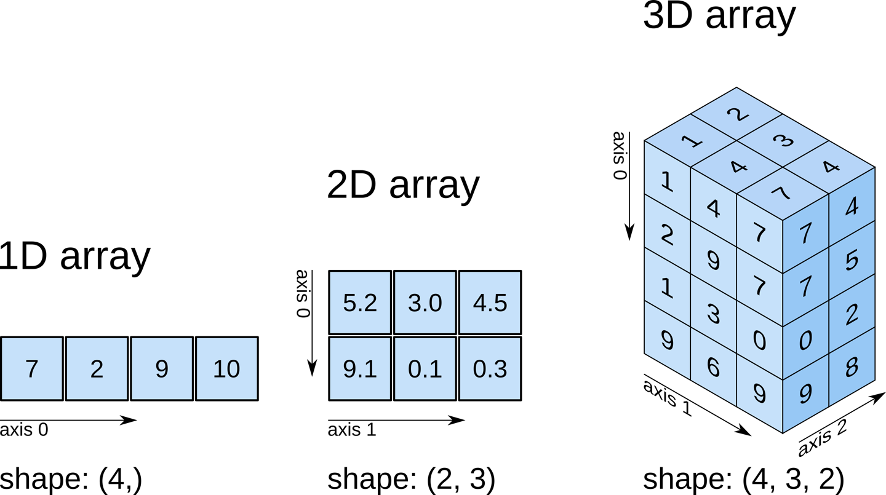

=======================
Developer Documentation
=======================

This section is meant to introduce new developers to the architecture / design of this
system.

Data Structures
===============
There are a few key data structures with which one needs to be familiar in order
to work on this code. We deal with four main types of data. Those are:

    - images
    - intensity profile data in two forms:

        - raw, extracted from the images
        - functional representations of the raw data
    - tabular "summary" data

Each of these types of data are naturally internally represented in different ways.
We will go over each individually.

Images
------
Images are represented internally as numerical matrices, specifically as numpy
matrices. Thinking of a single black-and-white image, each pixel is represented by a
single number. The range of that number depends on the data type used to store the
image internally. In our case, the raw images from our microscope come to us as
16-bit unsigned integers. This means that each pixel can take any value in the range
[0, 2^16].

Still thinking of a single black-and-white image, we can access individual pixels by
*indexing* into the rows and columns of that image. For example, to get the value 10
pixels down and 3 pixels across (starting from the top left), we would use the
following notation::

    img[10, 3]

This graphic shows examples of more advanced matrix indexing.

.. image:: _static/numpy_indexing.png

Many images can be 'stacked' on top of each other, as if they were sheets of paper.
Numpy handles this case as well. All that needs to be done is to add another
dimension to our matrices. Now they are three-dimensional, with the first dimension
indicating which sheet of paper we are dealing with, and the second and third
indicating the rows and columns as before.

For an even deeper dive on indexing, see the `numpy indexing documentation
<https://docs.scipy.org/doc/numpy/reference/arrays.indexing.html>`_.