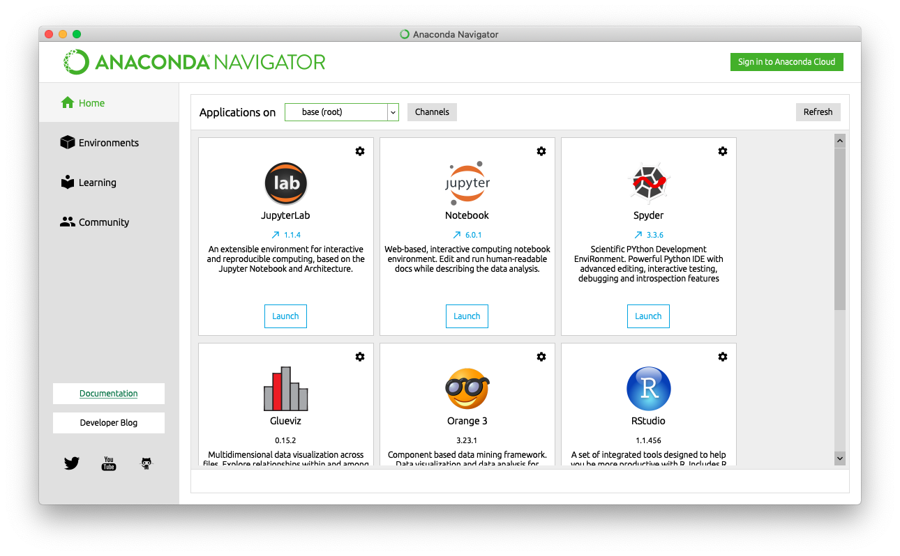
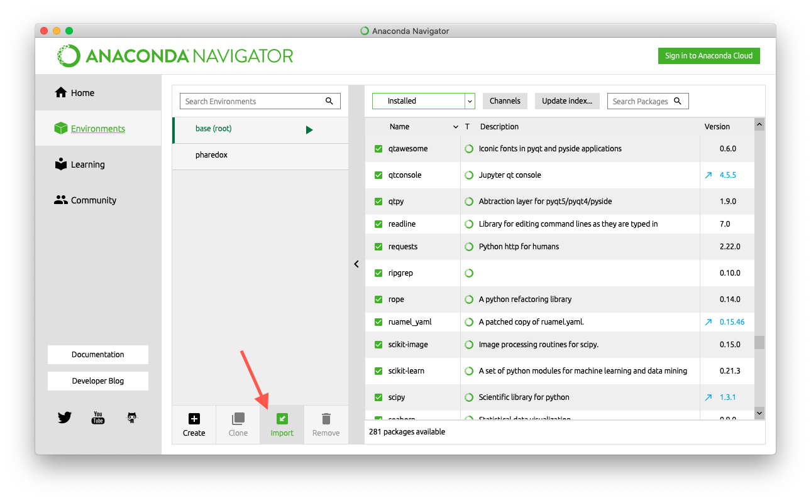

.. _installation:

############
Installation
############

Download source code
--------------------
In your terminal application, navigate to the directory in which you would like the new 
source code directory to live, then type::
    
    $ git clone https://github.com/half-adder/pharynx_redox.git

This will create a directory called ``pharynx_redox`` in the parent directory.

Install Anaconda
----------------
Anaconda is a package manager designed for scientific code. Download it via the 
`Anaconda download page`_ and follow the installation instructions.

Install Anaconda packages
-------------------------
PhaRedox depends on a number of open-source packages. Anaconda makes getting all of
these packages on your machine very easy. You can do this either through Anaconda's
graphical user interface, or through a terminal.

GUI
***

Open the Anaconda Navigator application. It should look like this:

Click on ``Environments``, then click ``Import``:

Now, use ``pharedox`` as the environment name. Use the ``conda-env.yml`` (found
in the top level of the source code directory) as the import file. 

MATLAB
------

PhaRedox requires MATLAB be installed and accessible to Python. Please ensure that it is
installed before continuing (your university probably has instructions on how to do
this).

.. warning::
    PhaRedox was developed using ``MATLAB_R2019a``. Other versions are not guaranteed
    to work, though you are free to try.

Add PhaRedox files to MATLAB path
*********************************
In MATLAB, look for ``Set Path`` in the ``Home`` tab. Click it, then in the dialog,
click ``Add with subfolders``, and navigate to the PhaRedox source directory and select
the ``matlab`` folder. 

Install MATLAB engine in Python
*******************************

At the MATLAB command prompt, type::

    >> matlabroot

    ans =

        '/Applications/MATLAB_R2019a.app'

In a system prompt, execute the following commands (replace ``<matlabroot>`` with
output of the above command)::

    $ cd <matlabroot>/extern/engines/python
    $ conda activate pharedox
    $ python setup.py install

Test Installation
-----------------

You should now have a complete installation! To make sure that everything works, run
the automated test suite. Open a system prompt, change directory to the source code, and
execute the following command::

    $ pytest

If everything is working, there should be no errors (warnings are ok). The final output
line should look something like::

    ========= 15 passed, 2 skipped, 2 warnings in 65.97s (0:01:05) =========

.. _PhaRedox source code directory: https://github.com/half-adder/pharynx_redox 
.. _Anaconda download page: https://www.anaconda.com/distribution/