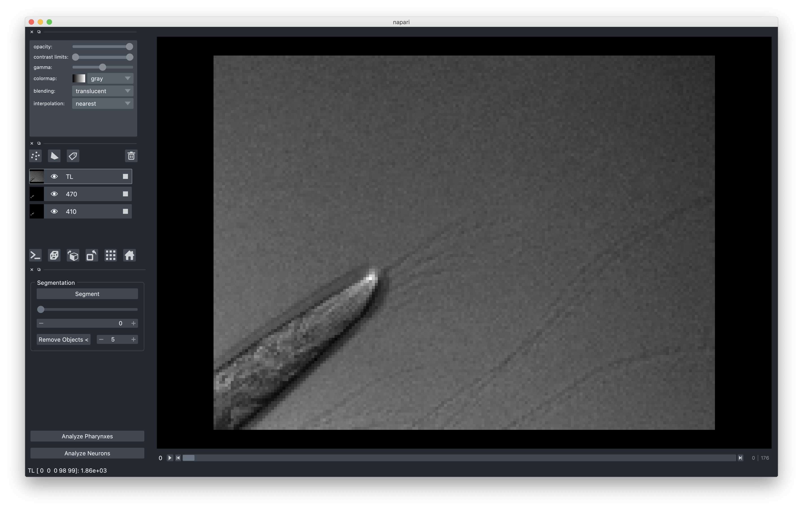

###########
Basic Usage
###########

This package makes analysis of your image stacks easy. Here, we will walk through a
basic example of analyzing a fresh image stack from start to finish.

Before beginning, ensure that the package is successfully installed (see
:ref:`installation`).

Capturing Images
================

During image capture, be sure to keep track of the strain of each animal. You will
need to know who is who during analysis. This is referred to as the ``strain indexer``.
The software expects the strain indexer in the following format:

    +--------+--------------+------------+
    | strain | start_animal | end_animal |
    +--------+--------------+------------+
    | HD233  | 1            | 100        |
    +--------+--------------+------------+
    | SAY47  | 101          | 200        |
    +--------+--------------+------------+
    | HD233  | 201          | 300        |
    +--------+--------------+------------+

Organizing Files
================

Create a folder on your computer with the following format (we will refer to this as
the ``experiment ID``)::

    YYYY_MM_DD-experiment_id

For example, let's say we've imaged HD233 and SAY47 at 4mm levamisole. An appropriate
experiment ID might be::

    2019_02_26-HD233_SAY47_4mm_lev

Once the folder is created, save your image stack as ``experiment_id.tiff`` and
strain indexer as ``experiment_id-indexer.csv`` in that folder. 

So in our example, we would save our image stack as ``2019_02_26-HD233_SAY47_4mm_lev.tiff`` and our strain
indexer as ``2019_02_26-HD233_SAY47_4mm_lev-indexer.csv``.

Settings File
=============

The pipeline requires multiple paramters be set. These parameters are specified in
the config file. To create a config file, navigate to your directory, then run the
`pharedox create-settings` command, like so::

    $ cd /path/to/experiment/directory
    $ pharedox create-settings

This will create a template configuration file, which you can customize to your liking.

Running the Analysis
====================

Once all of the files are in place, running the analysis is easy.

Automated
---------

If you are confident in the segmentation, you can run the analysis without loading up
the GUI. To do this, simply execute the following command::

    $ pharedox analyze --no-gui "path/to/experiment directory"

GUI
---

The GUI (Graphical User Interface) can be helpful to make sure that your masks are
correct. To launch the GUI, open a terminal, and execute the following command (make
sure to include the quotation marks)::

    $ pharedox analyze "path/to/experiment directory"

This command will open a user interface with your images. We will use this interface
to generate masks, which indicate where in each image the objects of interest are.
You can hide/show each channel by clicking on the eye icon in the appropriate
channel pane.

Set the threshold to a reasonable value based on your data. You can use the slider
or type in the threshold box to update the threshold interactively. If your images
contain small bright objects, you can use the ``Remove Objects <`` button to remove
objects smaller than the given number.

Once you are satisfied with the masks, simply press either ``Analyze Pharynxes`` or
``Analyze Blobs``, depending on your experiment. ``Analyze Blobs`` is meant for
measuring neurons, the gut, or any other structure with non-stereotypical geometry.

You can monitor the status of the pipeline through the terminal with which you
launched PhaRedox. If everything went well, there will be a pop-up window indicating
that the pipeline has finished running. When you click ``Open`` you will be taken to
the analysis directory containing the data from your experiment.

Getting at the Data
===================
Each time you run an analysis, you will generate a directory within the ``analyses``
directory. These subdirectories are named starting with the date on which the
analysis was run, and include a "strategy", which was specified in your settings
file (this if for your reference, if you changed this or that setting you can come
up with a name to reflect that).

After running a single analysis, the directory structure will look something like this::

    /Users/sean/Downloads/2019_05_16_gcy8_hsf1_afd_20C
    ├── 2019_05_16_gcy8_hsf1_afd_20C-indexer.csv
    ├── 2019_05_16_gcy8_hsf1_afd_20C.tif
    ├── analyses
    │   └── 2020-04-16_testing
    │       ├── 2019_05_16_gcy8_hsf1_afd_20C-trimmed_profile_data.csv
    │       ├── 2019_05_16_gcy8_hsf1_afd_20C-trimmed_profile_data.nc
    │       ├── 2019_05_16_gcy8_hsf1_afd_20C-trimmed_region_data.csv
    │       ├── 2019_05_16_gcy8_hsf1_afd_20C-untrimmed_profile_data.csv
    │       ├── 2019_05_16_gcy8_hsf1_afd_20C-untrimmed_profile_data.nc
    │       ├── 2019_05_16_gcy8_hsf1_afd_20C-untrimmed_region_data.csv
    │       └── figs
    │           ├── 2019_05_16_gcy8_hsf1_afd_20C-movement_annotation_imgs.pdf
    │           ├── 2019_05_16_gcy8_hsf1_afd_20C-ratio_images-pair=0;timepoint=0.pdf
    │           └── profile_data
    │               ├── trimmed_profiles
    │               │   ├── avgs
    │               │   │   ├── 2019_05_16_gcy8_hsf1_afd_20C-wavelength=410;pair=0;timepoint=0-avgs.pdf
    │               │   │   ├── 2019_05_16_gcy8_hsf1_afd_20C-wavelength=470;pair=0;timepoint=0-avgs.pdf
    │               │   │   ├── 2019_05_16_gcy8_hsf1_afd_20C-wavelength=e;pair=0;timepoint=0-avgs.pdf
    │               │   │   ├── 2019_05_16_gcy8_hsf1_afd_20C-wavelength=oxd;pair=0;timepoint=0-avgs.pdf
    │               │   │   └── 2019_05_16_gcy8_hsf1_afd_20C-wavelength=r;pair=0;timepoint=0-avgs.pdf
    │               │   └── individual
    │               │       ├── 2019_05_16_gcy8_hsf1_afd_20C-wavelength=410;pair=0;timepoint=0-individuals.pdf
    │               │       ├── 2019_05_16_gcy8_hsf1_afd_20C-wavelength=470;pair=0;timepoint=0-individuals.pdf
    │               │       ├── 2019_05_16_gcy8_hsf1_afd_20C-wavelength=e;pair=0;timepoint=0-individuals.pdf
    │               │       ├── 2019_05_16_gcy8_hsf1_afd_20C-wavelength=oxd;pair=0;timepoint=0-individuals.pdf
    │               │       └── 2019_05_16_gcy8_hsf1_afd_20C-wavelength=r;pair=0;timepoint=0-individuals.pdf
    │               └── untrimmed_profiles
    │                   ├── avgs
    │                   │   ├── 2019_05_16_gcy8_hsf1_afd_20C-wavelength=410;pair=0;timepoint=0-avgs.pdf
    │                   │   ├── 2019_05_16_gcy8_hsf1_afd_20C-wavelength=470;pair=0;timepoint=0-avgs.pdf
    │                   │   ├── 2019_05_16_gcy8_hsf1_afd_20C-wavelength=e;pair=0;timepoint=0-avgs.pdf
    │                   │   ├── 2019_05_16_gcy8_hsf1_afd_20C-wavelength=oxd;pair=0;timepoint=0-avgs.pdf
    │                   │   └── 2019_05_16_gcy8_hsf1_afd_20C-wavelength=r;pair=0;timepoint=0-avgs.pdf
    │                   └── individual
    │                       ├── 2019_05_16_gcy8_hsf1_afd_20C-wavelength=410;pair=0;timepoint=0-individuals.pdf
    │                       ├── 2019_05_16_gcy8_hsf1_afd_20C-wavelength=470;pair=0;timepoint=0-individuals.pdf
    │                       ├── 2019_05_16_gcy8_hsf1_afd_20C-wavelength=e;pair=0;timepoint=0-individuals.pdf
    │                       ├── 2019_05_16_gcy8_hsf1_afd_20C-wavelength=oxd;pair=0;timepoint=0-individuals.pdf
    │                       └── 2019_05_16_gcy8_hsf1_afd_20C-wavelength=r;pair=0;timepoint=0-individuals.pdf
    ├── processed_images
    │   ├── fluorescent_images
    │   │   ├── 2019_05_16_gcy8_hsf1_afd_20C-wvl=410_pair=0.tif
    │   │   ├── 2019_05_16_gcy8_hsf1_afd_20C-wvl=470_pair=0.tif
    │   │   └── 2019_05_16_gcy8_hsf1_afd_20C-wvl=TL_pair=0.tif
    │   ├── rot_fl
    │   │   ├── 2019_05_16_gcy8_hsf1_afd_20C-wvl=410_pair=0.tif
    │   │   ├── 2019_05_16_gcy8_hsf1_afd_20C-wvl=470_pair=0.tif
    │   │   └── 2019_05_16_gcy8_hsf1_afd_20C-wvl=TL_pair=0.tif
    │   ├── rot_seg
    │   │   ├── 2019_05_16_gcy8_hsf1_afd_20C-wvl=410_pair=0.tif
    │   │   ├── 2019_05_16_gcy8_hsf1_afd_20C-wvl=470_pair=0.tif
    │   │   └── 2019_05_16_gcy8_hsf1_afd_20C-wvl=TL_pair=0.tif
    │   └── segmented_images
    │       ├── 2019_05_16_gcy8_hsf1_afd_20C-wvl=410_pair=0.tif
    │       ├── 2019_05_16_gcy8_hsf1_afd_20C-wvl=470_pair=0.tif
    │       └── 2019_05_16_gcy8_hsf1_afd_20C-wvl=TL_pair=0.tif

